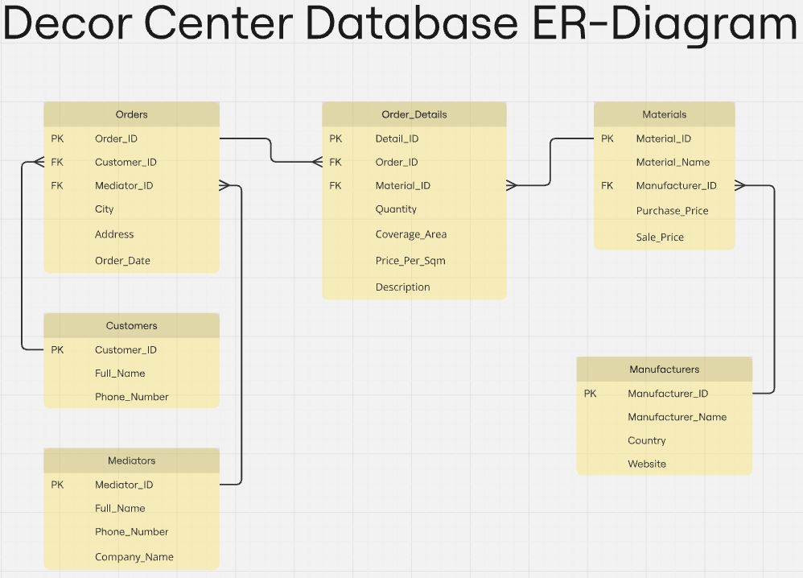

# Decor Center Database Project

## ER Diagram

At this stage of the project, the ER diagram for the database was created to manage orders for the GS-studio decor center. The diagram represents a relational model consisting of six tables:

1. **Orders**:
   - Contains information about orders, including customers, mediators, and project addresses.
   - Fields:
     - `Order_ID` (PK): Unique identifier for the order.
     - `Customer_ID` (FK): Reference to the `Customers` table.
     - `Mediator_ID` (FK): Reference to the `Mediators` table (optional).
     - `City`: The city where the project is located.
     - `Address`: The project’s address.
     - `Order_Date`: The date the order was placed.

2. **Order_Details**:
   - Describes materials and details associated with each order.
   - Fields:
     - `Detail_ID` (PK): Unique identifier for the order detail.
     - `Order_ID` (FK): Reference to the `Orders` table.
     - `Material_ID` (FK): Reference to the `Materials` table.
     - `Quantity`: The quantity of the material in kilograms.
     - `Coverage_Area`: The area covered (in square meters).
     - `Price_Per_Sqm`: The cost of applying the material per square meter.
     - `Description`: A description of the finishing work (optional).

3. **Customers**:
   - Stores information about clients placing orders.
   - Fields:
     - `Customer_ID` (PK): Unique identifier for the customer.
     - `Full_Name`: Full name of the customer.
     - `Phone_Number`: Contact phone number.

4. **Mediators**:
   - Describes mediators (e.g., contractors) who represent customers.
   - Fields:
     - `Mediator_ID` (PK): Unique identifier for the mediator.
     - `Full_Name`: Full name of the mediator.
     - `Phone_Number`: Contact phone number.
     - `Company_Name`: The name of the mediator's company (optional).

5. **Materials**:
   - Stores information about construction materials.
   - Fields:
     - `Material_ID` (PK): Unique identifier for the material.
     - `Material_Name`: Name of the material.
     - `Manufacturer_ID` (FK): Reference to the `Manufacturers` table.
     - `Purchase_Price`: Purchase price per unit.
     - `Sale_Price`: Selling price per unit.

6. **Manufacturers**:
   - Stores information about material manufacturers.
   - Fields:
     - `Manufacturer_ID` (PK): Unique identifier for the manufacturer.
     - `Manufacturer_Name`: Name of the manufacturer.
     - `Country`: The country where the manufacturer is based.
     - `Website`: The manufacturer’s website.

---

### ER Diagram

Below is the ER diagram illustrating the relationships between the tables:

---

## Data Generation and Python Scripts

At this stage of the project, Python scripts were developed to generate data for all tables and save it as CSV files. These scripts automate data creation and processing to populate the database with realistic information. 

### Python Scripts

1. **`config.py`**:
   - Contains configuration settings, including the file path for saving generated data.
   - Provides utility functions:
     - Ukrainian phone number generation.
     - Ukrainian name generation.

2. **`manufacturers_data_extractor.py`**:
   - Scrapes manufacturer information and decorative material details from [Prof-Decor](https://prof-decor.com.ua/brands).
   - Combines scraped data with website details from `manufacturers_sites.txt`.
   - Outputs the final manufacturer data into `manufacturers.json`.

3. **`manufacturers_data_creator.py`**:
   - Converts the JSON file from the extractor script into a CSV file `manufacturers.csv`.
   - Prepares manufacturer data for database import.

4. **`materials_data_creator.py`**:
   - Generates material data based on the manufacturer data.
   - Outputs a CSV file `materials.csv` containing material details such as prices and names.

5. **`customers_data_creator.py`**:
   - Generates customer data, including full names and phone numbers.
   - Outputs a CSV file `customers.csv`.

6. **`mediators_data_creator.py`**:
   - Creates mediator data with names, phone numbers, and optional company names.
   - Outputs a CSV file `mediators.csv`.

7. **`orders_data_creator.py`**:
   - Generates order information, linking customers, mediators, and order details.
   - Outputs a CSV file `orders.csv`.

8. **`order_details_data_creator.py`**:
   - Generates detailed order information, linking orders to materials and including quantities, coverage areas, and descriptions.
   - Outputs a CSV file `order_details.csv`.

### Generated Data

All generated datasets are stored in the **`Generated Data`** folder in CSV format. These datasets include:

- `manufacturers.csv`
- `materials.csv`
- `customers.csv`
- `mediators.csv`
- `orders.csv`
- `order_details.csv`

---

## Importing Data into the Database

### 1. **Database Tables Creation**
Using the SQL script **`DB Tables Creation.sql`** (located in the `SQL Queries` folder), I created all the necessary tables in the PostgreSQL database. The script is based on the database model presented earlier.

### 2. **Data Import**
The generated CSV files were imported into the database using **pgAdmin's import functionality**. The imported files are located in the `Generated Data` folder and correspond to the following tables:
- `customers.csv` → `customers`
- `manufacturers.csv` → `manufacturers`
- `materials.csv` → `materials`
- `mediators.csv` → `mediators`
- `orders.csv` → `orders`
- `order_details.csv` → `order_details`

### 3. **Data Verification**
To ensure the data was correctly imported, I executed simple SQL queries to check table contents and relationships.

## Extracting Data into Power BI

### Selected Tables for Visualization
For the visualizations, I decided to use the following tables:  
- **Orders Table (`orders`)**: Contains details about each order, including the date and location.  
- **Mediators Table (`mediators`)**: Provides information about mediators and their associated companies.  
- **Main Table**: A custom table created using an SQL query that joins multiple tables based on the `order_details` table.  
  - The SQL query is stored in the `SQL Queries` folder in the file **`Main table for Power BI.sql`**.

### Importing Tables into Power BI
Using Power BI's built-in PostgreSQL connector, I imported all necessary tables directly from the database. After importing:  
- I verified the relationships between the tables in **Model View** to ensure they correctly reflected the database's relational structure.

### Data Transformation in Power Query
In **Power Query**, I created two calculated columns in the `main table`:  
1. **Profit**:  
   Formula: ([sell_price] - [purchase_price]) * [quantity]
Represents the profit generated from selling materials.  

2. **Profit_for_cover**:  
Formula:  ([coverage_area] * [price_per_sqm] * 0.3)
This column accounts for 30% of the total revenue, with the remaining 70% allocated for worker and mediator fees.  

Additionally, I formatted the data for better readability:
- Converted all monetary values to the **Currency** type in Ukrainian Hryvnia (UAH).  
- Adjusted other data types for consistency.  

This preparation ensures the data is clean, structured, and ready for visualization in Power BI.

